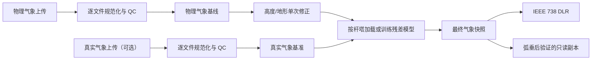

# DLR 修正链路与弧垂后验证设计

## 1. 目标与约束

本设计用于修复当前动态线路额定值（DLR）系统中的计算漏洞，同时保持既有页面的布局、控件和图表不变。允许的界面变化只有两项：

1. 现有侧边栏增加“真实气象数据”上传入口；
2. 增加独立的“弧垂后验证”页面。

用户已经确认的行为约束：

- 地形修正和 XGBoost 修正保留，因为它们是项目要求；
- 每个杆塔分别训练风速和环境温度残差模型；
- 没有模型且有真实气象数据时自动训练，模型和元数据保存到后台，下次优先加载；
- 不设最低样本数。样本少时允许全量训练；
- AI 效果只比较修正后气象与真实气象的 MAE/RMSE，不用 DLR 指标评价训练效果；
- 候选模型只有在气象误差更优时才替换当前模型；
- 预测结果受物理范围和历史残差范围约束，训练失败回退物理路径；
- 弧垂后验证与 DLR 主流程完全独立，只上传倾角即可运行；
- 档距、导线和参考参数能从现有数据推导就推导，否则使用后台默认值；
- 页面结果不显示“默认值”或“假设”标签，但后台结果和日志必须记录参数来源。

本阶段不改变页面视觉设计，不把未经验证的弧垂结果回写到 DLR 额定值。

## 2. 总体架构

保留 `dispatch_app_st.py` 作为现有页面入口，将计算职责收敛到可测试的后台服务。页面只负责上传、选择、触发和展示。



建议的职责边界如下：

- `modules/data_processor.py`：逐文件格式识别、规范化、长表清洗、逐塔时间重采样；
- `modules/terrain.py`：GeoTIFF 读取、CRS 转换、塔位地形查询；
- `modules/weather_correction.py`：高度、地形、温度和项目环境修正，仅产生新数据对象；
- `modules/ai_prediction.py` 及训练服务：特征、训练、评估、加载、晋级和物理边界；
- `modules/thermal_engine.py`：唯一 IEEE 738 热平衡内核；
- `modules/sag_validation.py`：独立的倾角反推和专利后验证状态机；
- 页面层：上传文件、调用服务、保存不可变快照和显示结果。

`thermal_functions.py` 保留为旧接口兼容层，但不能再包含另一套热模型实现。

## 3. 统一数据契约与唯一流水线

### 3.1 规范化长表

所有输入先转换为长表，最后一步才按页面需要 pivot 成矩阵。核心键为字符串形式的：

```text
project_id + line_id + tower_id + timezone-aware timestamp
```

塔号保留前导零，不能使用数组下标作为连接键。字段至少包括：

```text
tower_id, timestamp, longitude, latitude,
ambient_temp, wind_speed, wind_direction,
solar_radiation, humidity, elevation,
measurement_height, source_file_hash
```

每个字段保留单位、质量状态和来源 `measured / derived / default`。时间统一使用项目时区的带时区时间戳；夏令时和无时区输入按配置处理并记录。

### 3.2 处理顺序

训练和推理必须调用同一个不可变转换器，固定顺序为：

1. 逐文件读取和格式识别；
2. 字段、单位、时间和数值质量检查；
3. 按规范键去重并记录丢弃行；
4. 杆塔元数据和 DEM 地形 join；
5. 高度、地形和项目环境修正一次；
6. 按塔位进行时间重采样和插值；
7. 构造模型特征和残差；
8. 物理范围与历史残差范围约束；
9. 生成最终气象快照；
10. 调用 IEEE 738 或弧垂服务。

阶段对象分别命名为 `physical_weather`、`terrain_corrected_weather`、`ai_corrected_weather` 和 `final_weather`，保留原始列，禁止原地覆盖。阶段令牌用于拒绝重复应用同一修正。

逐塔重采样不得把不同塔位的数据求全局均值。风向使用圆周插值（先转 `sin/cos`），太阳辐射、湿度和温度按塔位独立处理；缺测只能使用该塔的允许策略，不能跨塔填补。

## 4. 真实气象上传与 XGBoost 模型

### 4.1 数据隔离和匹配

真实气象上传入口位于现有侧边栏。上传文件先保存字节哈希和规范化版本，不能依赖 Streamlit `UploadedFile` 指针跨 rerun 存活。

物理气象和真实气象是两个独立数据集。真实值只能用于训练和评估，禁止通过共享 `session_state` 进入 DLR 主计算。两者按 `line_id + tower_id + timestamp` 对齐，允许配置的最近邻时间容差，但禁止使用未来真实值。物理输入和真实输入哈希相同或完全重合时阻止训练并提示原因。

残差定义为：

```text
residual = truth - terrain_corrected_physical
```

真实测量高度和物理基线高度必须一致；若不一致，先按同一高度折算，再计算残差，不能让模型把高度偏差学成局地天气。

### 4.2 特征和训练

每个 `line_id + tower_id + target` 单独训练一个 `XGBRegressor`。目标只有：

- `wind_speed_residual`；
- `ambient_temp_residual`。

特征包括物理基线值、风向的 `sin/cos`、辐射、湿度、海拔、坡度、坡向、小时/年内日周期特征，以及按塔位排序后的物理滞后特征。滞后特征不能跨塔、跨不规则时间间隔或跨数据集计算。

不设置最低样本数：

- 至少有两个连续时间块时，使用时间留出或滚动验证；
- 样本只有一个时间块时直接全量拟合，并记录 `evaluation_mode=full_fit`；
- 单样本、常量残差或 XGBoost 不可用时使用零/中位数残差基线，不阻断 DLR。

气象评价只计算基线和修正后的 MAE、RMSE。已有模型和候选模型必须在同一冻结评估集上比较；全量拟合误差不能自动覆盖已有冠军模型。首次模型可以保存为候选，之后有独立评估集且误差改善超过配置阈值才自动晋级。

预测残差先按该塔历史残差的稳健分位数或 MAD 范围裁剪，再施加显式物理边界：风速不小于 0，温度限制在配置的环境范围内。NaN、无穷和超界结果回退到地形修正后的物理值，并记录 `fallback_reason`。

### 4.3 模型存储和并发

模型路径必须包含项目和线路命名空间：

```text
models/<project_id>/<line_id>/<tower_id>/<target>/model.joblib
models/<project_id>/<line_id>/<tower_id>/<target>/metadata.json
```

元数据包括模型版本、特征列表、训练参数和随机种子、时间范围、样本数、评估方法、基线/修正误差、残差边界、输入数据哈希、DEM/CRS/坐标版本、导线和修正配置哈希、依赖版本及文件校验和。

每塔每目标使用锁和注册表 manifest。候选模型先临时写入、重新加载校验和评估，通过后再原子替换；损坏模型只影响该塔该目标。配置、DEM 或导线变化会使不兼容模型失效。没有真实值时只加载已有模型，不触发重训；没有模型和真实值时走纯物理路径。

## 5. 地形修正边界

DEM 优先使用 GeoTIFF 的 CRS、仿射变换、像元尺寸和 nodata 信息。经纬度先转换到 DEM CRS，再查询塔位。坡度使用真实水平像元尺寸，坡向统一为 0～360°。

点位越界、nodata 或缺少地理参考时不夹到边缘，使用默认地形值并记录原因。杆塔、DEM、模型和结果全部按规范化 `tower_id` 连接。

高度修正使用配置的幂律风速和温度递减模型。风向保留原值，风与导线的夹角只在 IEEE 对流系数中计算，不在气象流水线再乘一次横风系数。沙漠反照率、湿度和风沙参数均是显式项目配置，只能应用一次。

热模型只接受已经生成的本地气象状态，不接受 `slope/aspect` 触发内部修正，也不修改传入对象。可通过不可变 `WeatherState` 和 `correction_stage` 断言这一边界。

## 6. IEEE 738 热模型

### 6.1 稳态热平衡

唯一热平衡内核使用：

```text
I² R(Tc) + qs = qc + qr
```

允许温度为 `Tc=Tmax` 时求额定电流，所有输入采用 SI 单位。对流散热取自然对流和两种强制对流关联式中的最大值：

```text
qcn = 3.645 × rho^0.5 × D^0.75 × (Tc − Ta)^1.25
qcc1 = Kangle × (1.01 + 1.35 × Re^0.52) × kf × (Tc − Ta)
qcc2 = Kangle × 0.754 × Re^0.60 × kf × (Tc − Ta)
qc = max(qcn, qcc1, qcc2)
```

其中 `Re`、空气密度、导热系数、黏度和 `Kangle` 按 IEEE 738 计算，`Kangle` 由风向与线路方位角得到。零风速时仍保留自然对流，不能直接返回零。空气物性使用膜温，电阻按导线温度和所选导线目录插值。

辐射采用绝对温度和发射率。太阳热在实测辐射和晴空模型之间二选一，只应用一次入射角和地面反照率修正。项目修正不能替代 IEEE 标准项。

### 6.2 暂态和 DLR 口径

线路全景页保留原有显示口径；每塔每时刻使用同一导线参数计算稳态 DLR。日前/日内暂态路径使用热容量、秒级时间步长和热平衡积分，并严格校验电流/时间长度。暂态不收敛时回退到稳态保守值。

全线瓶颈按塔位额定值取最小，同时保存造成瓶颈的塔号和时间。静态对照与动态结果使用同一导线目录参数，禁止硬编码 `795 A`。

## 7. 独立弧垂后验证

新增 `pages/弧垂后验证.py`。页面只要求上传倾角文件，可识别塔号、时间和倾角列；塔号或时间缺失时使用页面选定塔位、已有快照时间或连续采样序号。其他参数从只读快照推导或取后台默认值。

参数优先级为 `measured → derived → default`：

- `L` 优先已有档距，否则由相邻杆塔坐标计算；
- `w` 由单位质量和重力加速度计算；
- `E/A/alpha` 由导线目录或材料参数得到；
- `T1` 优先同塔同时间导线温度，否则参考温度；
- `H1` 优先参考张力，否则设计初始水平张力。

对有效倾角 `theta` 执行专利公式：

```text
H = w × L / (2 × tan(theta))
DeltaT = (H1 − H) / (E × A × alpha)
Tm = T1 + DeltaT
DeltaT_error = Tm − T_theor
```

只有 `Tm > T_theor` 且误差超过由倾角波动、风速波动、档距、导线参数和历史偏差确定的自适应阈值时才修正。修正采用：

```text
k = sqrt((T_theor − Ta) / (Tm − Ta))
I_derate = k × I_orig
I_checked = min(I_orig, I_recalc, I_derate)
```

`k`、分母和角度范围均有边界保护。状态机为 `NORMAL → RISK → RECOVERY → NORMAL`，异常角度进入 `INVALID`；风险快降、恢复慢升，进入和退出使用不同阈值。

弧垂服务接收一次性不可变快照，生成独立 `result_id`。运行前后必须保证主页面 `line_data` 和 `max_currents` 深度不变。页面不显示默认值来源标签，后台结果和日志保存参数来源、公式版本、输入哈希和异常原因。

## 8. 异常、回退和可观测性

错误按最小范围处理：单条数据异常则丢弃或使用该塔允许的插值策略；DEM 点异常则该塔使用默认地形；单塔模型损坏则该塔回退物理路径；XGBoost 依赖缺失则全线物理计算；热平衡不收敛则该时刻稳态保守回退；弧垂异常只隔离该条记录。

所有回退、剪裁、插值、模型晋级和失效事件写结构化后台日志。日志至少包含 `run_id`、`result_id`、line/tower、阶段、输入哈希、配置哈希、来源、错误码和 `fallback_reason`。原始上传文件只按配置保留，模型元数据不依赖临时文件路径。

## 9. 测试与验收

### 单元测试

- 新旧气象格式规范化、单位和带时区时间；
- 重复行、缺测、未来真实值和最近邻容差；
- 长表按塔位重采样、风向圆周插值；
- CRS、DEM 像元尺寸、nodata 和越界；
- 修正服务幂等性、阶段令牌和输入不变性；
- 特征按塔排序、滞后边界和物理裁剪；
- 模型保存/加载、校验和、损坏回退和命名空间隔离；
- 倾角边界、专利公式、阈值触发和状态机回差。

### 物理回归测试

- IEEE 738 Drake 官方算例，额定电流约 `1025 A`，并核对各热项；
- 零风速自然对流仍大于零；
- 风向 0°、90°、180° 系数方向正确；
- 电阻、辐射、太阳热和海拔物性；
- 暂态热平衡单位和时间步长。

### 集成和页面测试

- 无模型、有真实值时自动训练并在下次运行加载；
- 小样本全量训练不被拒绝，但不能用训练误差自动替换已有冠军；
- 真实值不可对齐时 DLR 仍可运行且 AI 逐塔回退；
- DEM/导线/配置变化使旧模型失效；
- 多进程或 Streamlit rerun 不产生互相覆盖的模型；
- 现有页面控件和图表入口保持不变；
- 真实气象上传入口和弧垂页面可独立运行；
- 弧垂页面运行前后主 DLR 状态深度相等。

## 10. 兼容与迁移

现有 `thermal_functions`、数据读取函数和页面调用通过兼容适配层逐步迁移。主流程必须显式传递导线 `base_params`，不再依赖热模型内部默认导线。模型目录、日志目录和上传缓存目录使用配置或环境变量，不依赖本机绝对路径。

实施完成的最低验收标准是：现有页面能够运行，IEEE 回归算例通过，真实气象模型能保存并复用，所有失败路径可审计，弧垂后验证不改变 DLR 主结果。
